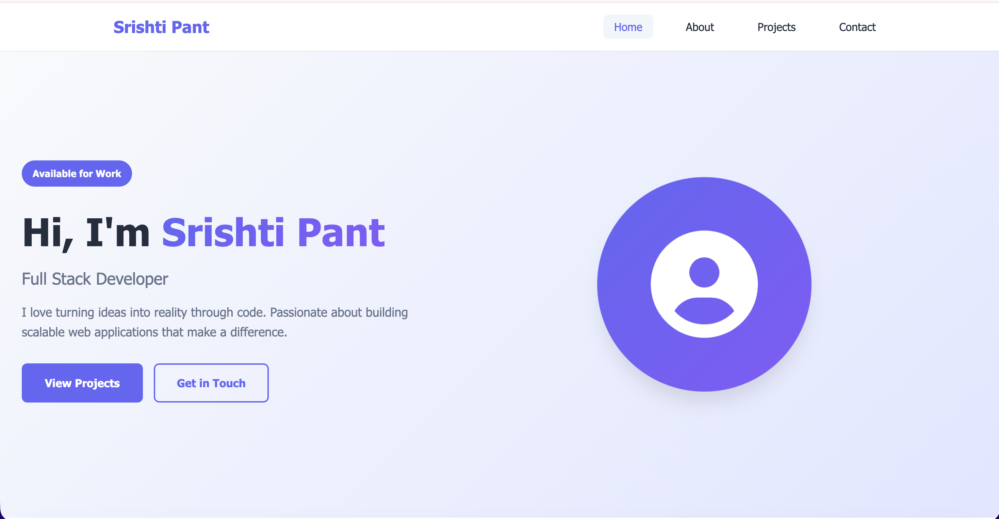
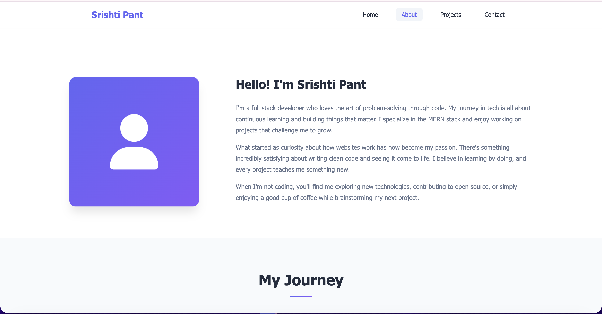
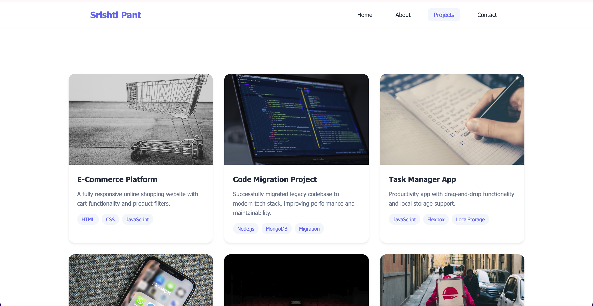
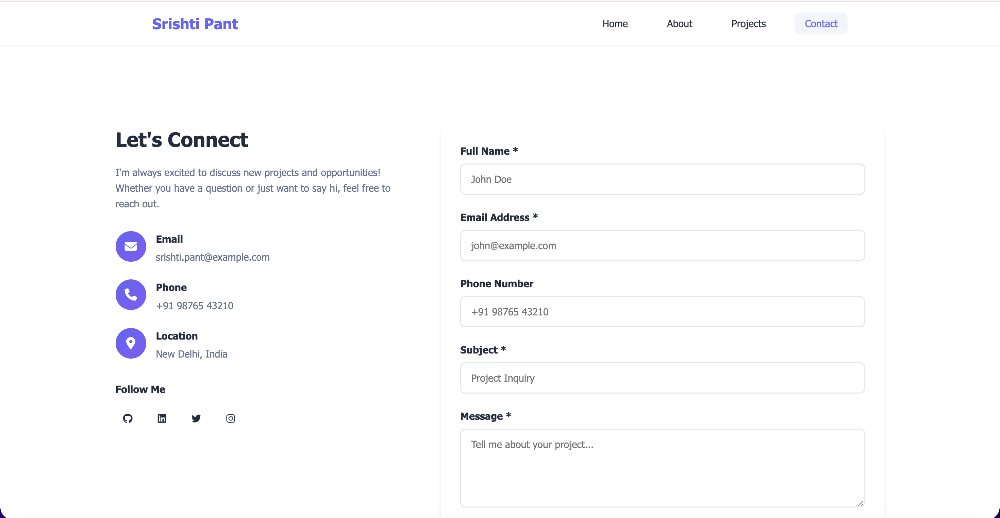

# 🌟 Srishti Pant - Personal Portfolio

A clean, modern, and fully responsive portfolio website built with pure HTML, CSS, and JavaScript as part of a mini-project to demonstrate comprehensive web development skills.




## 📋 Project Description

This is my personal portfolio website where I showcase my journey as a full stack developer. It's built from scratch using HTML, CSS, and JavaScript, demonstrating my understanding of web fundamentals and modern development practices. The site features a clean design with smooth animations and fully responsive layouts that work seamlessly across all devices.

## 🛠️ Tech Stack

- **HTML5** - Semantic markup and structure
- **CSS3** - Styling with modern features
  - CSS Variables for theming
  - Flexbox for flexible layouts
  - CSS Grid for complex layouts
  - Media Queries for responsiveness
  - Animations and Transitions
  - Pseudo-classes and Pseudo-elements
- **JavaScript** - Interactive functionality
  - Form validation
  - Mobile navigation
  - Scroll animations
  - Smooth scrolling
- **Font Awesome** - Icons
- **Git & GitHub** - Version control and hosting

## ✨ Features

### Pages

- 🏠 **Home** - Hero section with introduction and featured content
- 👤 **About** - Personal information, journey timeline, and skills progress
- 💼 **Projects** - Gallery of projects with pricing/services section
- 📧 **Contact** - Contact form with validation and contact information

### Key Highlights

- ✅ Fully responsive design (Mobile, Tablet, Desktop)
- ✅ Sticky navigation bar
- ✅ Smooth scroll animations
- ✅ Interactive hover effects
- ✅ Form validation with custom error messages
- ✅ CSS Grid image gallery
- ✅ Flexbox card layouts
- ✅ CSS Variables for consistent theming
- ✅ Mobile-first approach
- ✅ Semantic HTML structure
- ✅ Cross-browser compatible
- ✅ Accessible design (ARIA labels, focus states)

## 📂 Project Structure

```
portfolio/
│
├── index.html          # Home page
├── about.html          # About page
├── projects.html       # Projects page
├── contact.html        # Contact page
├── styles.css          # Main stylesheet
├── script.js           # JavaScript functionality
└── README.md           # Project documentation
```

## 🎨 CSS Concepts Used

| Concept              | Implementation                                    |
| -------------------- | ------------------------------------------------- |
| **Box Model**        | Padding, margin, border on all elements           |
| **Flexbox**          | Navigation bar, card layouts, button groups       |
| **Grid**             | Skills grid, projects gallery, footer layout      |
| **Position**         | Sticky navbar, absolute badges, fixed overlays    |
| **Media Queries**    | Mobile (480px), Tablet (768px), Desktop (1400px+) |
| **Animations**       | Hover effects, fade-in, slide-down, pulse, float  |
| **Pseudo-classes**   | :hover, :focus, :nth-child, :focus-visible        |
| **Variables**        | CSS custom properties for colors and values       |
| **Responsive Units** | rem, %, vw, vh, clamp()                           |

## 🔧 Installation & Setup

1. **Clone the repository**

```bash
git clone https://github.com/yourusername/portfolio.git
cd portfolio
```

2. **Open in browser**

```bash
# Simply open index.html in your browser
# Or use Live Server extension in VS Code
```

3. **Deploy to GitHub Pages**

```bash
git add .
git commit -m "Deploy to GitHub Pages"
git push origin main
```

Then enable GitHub Pages in repository settings.

## 📸 Screenshots

### Desktop View


### About Page



### Projects Page



### Contact Page



## 🌐 Browser Support

- ✅ Chrome (latest)
- ✅ Firefox (latest)
- ✅ Safari (latest)
- ✅ Edge (latest)
- ✅ Opera (latest)

## 📚 What I Learned

Through this project, I gained hands-on experience with:

1. **HTML Structure**: Creating semantic, accessible HTML5 markup
2. **CSS Layouts**: Mastering Flexbox and Grid for complex layouts
3. **Responsive Design**: Implementing mobile-first design with media queries
4. **CSS Animations**: Creating smooth transitions and keyframe animations
5. **JavaScript DOM**: Manipulating the DOM for interactive features
6. **Form Validation**: Building custom client-side form validation
7. **Git Workflow**: Using branches, commits, and pull requests effectively
8. **GitHub Pages**: Deploying a static website to production
9. **Code Organization**: Structuring CSS with comments and sections
10. **Best Practices**: Writing clean, maintainable, and documented code

## 🚀 Future Enhancements

- [ ] Add dark/light mode toggle
- [ ] Implement project filtering
- [ ] Add blog section
- [ ] Integrate contact form backend
- [ ] Add loading animations
- [ ] Implement lazy loading for images
- [ ] Add testimonials section
- [ ] Create downloadable resume feature

## 📝 Git Workflow

This project follows proper Git practices:

### Commits Made

1. ✅ Initial project structure setup
2. ✅ Add navbar and hero section
3. ✅ Create about page with timeline
4. ✅ Build projects gallery with grid
5. ✅ Add contact form with validation
6. ✅ Implement responsive design
7. ✅ Add animations and transitions
8. ✅ Final polish and documentation

### Branches Used

- `main` - Production branch
- `feature/navbar` - Navigation development
- `feature/responsive` - Responsive design implementation
- `feature/animations` - Animation and transitions

All features merged via Pull Requests for review.

## 👨‍💻 Author

**Srishti Pant**

- GitHub: [@srishtipnt](https://github.com/srishtipnt)
- LinkedIn: [Srishti Pant](https://www.linkedin.com/in/srishtipnt/)


## 📄 License

This project is open source and available under the [MIT License](LICENSE).

## 🙏 Acknowledgments

- Font Awesome for the amazing icon library
- Unsplash for beautiful project images
- The web development community for inspiration and support
- Everyone who has helped me learn and grow as a developer

---


